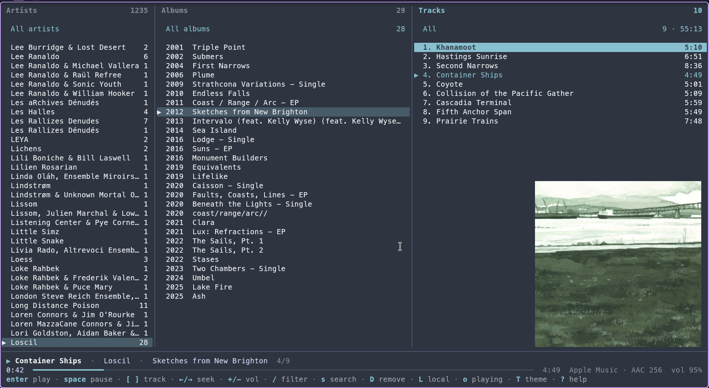

# scopolamine

scopolamine is a terminal program for [Apple Music](https://music.apple.com) and local music files on Linux. It is written in Go. It shows your library in three columns: artists, albums, and tracks. It plays full albums. It has no radio, no recommendations, and no playlists.

> This software was developed with the assistance of a LLM.



## Features

- Three columns: artists, albums, and tracks. Each column starts with an "All" row. "All albums" shows all the tracks of an artist, in groups by album.
- Albums in date order, and a track number on each track.
- A full album plays as one queue. Thus the tracks follow each other without a new start for each track.
- A fade-out of 0.2 seconds before a stop, a pause, a change of track, and the quit (`q`). A fade-in of 0.2 seconds after a pause.
- Album covers at the bottom of the track column, in kitty and Ghostty.
- 20 color themes with a live preview (`T`), as in godoist.
- A filter for each column (`/`).
- A local mode (`L`) for the music files in a folder. The local mode sorts the files by metadata or by folders (`v`). mpv plays them without gaps.
- A search of the Apple Music catalog (`s`), with the discography of each artist. A mark shows the albums that are in your library. You can play an album from the search, add it to your library (`a`), or remove it (`D`).
- Tracks that are not available in your country show as "unavailable". Playback skips them.
- Resume: at the next start, scopolamine shows the artist, album, and track of the last session, for each mode. `space` continues the last track at the same position.
- A library cache in SQLite. The program starts immediately and syncs in the background.
- Media keys and desktop media widgets through MPRIS.

The [changelog](CHANGELOG.md) gives more details.

## Requirements

- Linux on x86-64. On arm64, you must have a Chromium with the Widevine module, because Google supplies no Chrome for arm64 Linux.
- An Apple Music subscription.
- Go 1.27 or later, to build from the source.
- Approximately 140 MB of disk space for a private copy of Google Chrome. scopolamine downloads it at the first start.
- Approximately 750 MB of memory for Chrome and MusicKit. They run only for the Apple Music mode (see [Local mode](#local-mode)).
- A terminal with true color. For album covers: kitty or Ghostty.
- PipeWire or PulseAudio for the audio output.
- For the local mode: mpv and FFmpeg (ffprobe and ffmpeg).

## Installation

```sh
go install -trimpath -ldflags="-s -w" github.com/biomassa/scopolamine/cmd/scopolamine@latest
```

To build from a clone:

```sh
git clone https://github.com/biomassa/scopolamine
cd scopolamine
go build -trimpath -ldflags="-s -w" -o scopolamine ./cmd/scopolamine
```

`make` does the same build and copies the binary to `~/.local/bin`. `make BINDIR=/other/dir` selects a different directory. `make test` runs the tests.

## Sign-in

```sh
scopolamine login
```

1. scopolamine downloads its copy of Google Chrome, if necessary.
2. A Chrome window opens music.apple.com.
3. Click **Sign In** and sign in with your Apple ID.
4. The window closes when scopolamine finds your sign-in. The terminal shows "Signed in to Apple Music".

Then start the program:

```sh
scopolamine
```

The first start syncs your album list. A large library takes some time. The status line shows the progress.

To sign in with a different account, use `scopolamine logout` and then `scopolamine login`.

## Commands

| Command                                        | Action                                                      |
| ---------------------------------------------- | ----------------------------------------------------------- |
| `scopolamine`                                  | Start the TUI.                                              |
| `scopolamine --offline`                        | Browse the cache, without the player and without a sync.    |
| `scopolamine --theme NAME`                     | Use a color theme for this run only.                        |
| `scopolamine login`                            | Sign in to Apple Music.                                     |
| `scopolamine logout`                           | Remove the saved user token.                                |
| `scopolamine sync`                             | Sync the album list and show the progress.                  |
| `scopolamine token`                            | Show the source and the expiry date of the developer token. |
| `scopolamine token refresh`                    | Get the developer token again.                              |
| `scopolamine version`, `scopolamine --version` | Show the version.                                           |
| `scopolamine help`                             | Show the command usage.                                     |

## TUI

### Keys

| Key                    | Action                                                                                                                                                                                                                                     |
| ---------------------- | ------------------------------------------------------------------------------------------------------------------------------------------------------------------------------------------------------------------------------------------ |
| `tab`, `shift+tab`     | Go to the next or the previous column. `l`, `h`, and `1` `2` `3` also work.                                                                                                                                                                |
| `j` `k`, `↓` `↑`       | Move the cursor.                                                                                                                                                                                                                           |
| `g` `G`, `pgup` `pgdn` | Go to the top, the bottom, or one half page.                                                                                                                                                                                               |
| `/`                    | Filter the column. `esc` clears the filter.                                                                                                                                                                                                |
| `enter`                | On an artist: go to the albums. On an album: play it and go to the tracks. On a track: play from this track. On a row that holds the current track (the track, its album, or All albums): continue it. Elsewhere: play from there at 0:00. |
| `space`                | Play or pause. After a restart: continue the last track.                                                                                                                                                                                   |
| `←` `→`                | Seek 10 seconds back or forward. With `shift`, seek 60 seconds. `,` and `.` also work.                                                                                                                                                     |
| `]` `[`                | Play the next or the previous track. `n` `p` and `>` `<` also work.                                                                                                                                                                        |
| `+` `-`                | Change the volume.                                                                                                                                                                                                                         |
| `x`                    | Stop.                                                                                                                                                                                                                                      |
| `o`                    | Go to the album that plays.                                                                                                                                                                                                                |
| `L`                    | Switch between the Apple Music mode and the local mode.                                                                                                                                                                                    |
| `v`                    | Local mode: sort by metadata or by folders.                                                                                                                                                                                                |
| `F`                    | Local mode: set the music folder.                                                                                                                                                                                                          |
| `s`                    | Search Apple Music. Not in the local mode.                                                                                                                                                                                                 |
| `D`                    | Remove the album from your Apple Music library. scopolamine asks first. Not in the local mode.                                                                                                                                             |
| `R`                    | Sync the Apple Music album list, or scan the local folder.                                                                                                                                                                                 |
| `T`                    | Select a color theme.                                                                                                                                                                                                                      |
| `?`                    | Show the help and the version.                                                                                                                                                                                                             |
| `q`                    | Quit.                                                                                                                                                                                                                                      |

### Mouse

- A click selects a row and focuses its column. A click on a column title focuses the column.
- A double click on the row of the track that plays pauses it. A second double click continues it. On other rows, a double click does the same as `enter`.
- A click on a key in the legend runs that key. In `[ ]`, `+/-`, and `←/→`, each symbol is a key.
- A click on the progress bar seeks to that position.
- The mouse wheel moves the cursor of the column under the mouse.
- A click in a column stops the input of a filter or a search text. A click on the filtered column title or on the search line starts the input again.
- In the theme picker, a click shows a theme and a double click keeps it. In the folder box, a click on a listed folder puts it into the path. A click outside the box closes it.

### "All" rows

The "All" rows use the accent color of the theme. They stay at the top of their columns, and the list under them scrolls. "All artists" shows all the albums. "All albums" shows all the tracks of the selected artist, in groups by album. `enter` on "All albums" or on "All" plays all these tracks. When you select "All artists", "All albums" shows no tracks. The reason: that list needs one request for each album in the library.

### Search

`s` opens the search view. Type a search text. The search starts when you stop the input for a short time, or when you push `enter`.

- **Artists**: The first row, "Matching albums", shows the albums that match the search text. An artist row shows all the albums of that artist, oldest first.
- **Albums**: "✓ in library" marks the albums that are in your library. A pale "single" tag at the right marks the singles.
- `enter` plays an album. It does not add the album to your library.
- `a` adds the album to your library. The album shows in the library view immediately.
- `m` marks the album under the cursor. `M` marks all albums of the column that are not in the library, without singles. With marks, `a` adds all marked albums.
- `D` removes an album that has the "✓ in library" mark.
- `s` or `/` changes the search text. `esc` returns to the library view.

The search uses the catalog of your country only.

### Remove an album

`D` removes an album from your Apple Music library. The status line asks for a confirmation. Push `y` to remove the album. Any other key cancels the removal.

- In the album column, `D` removes the selected album.
- In the track column, `D` removes the album of the selected row.
- `D` does not remove "All albums" or an artist.

### Local mode

`L` switches between the Apple Music mode and the local mode. Each mode keeps its selection, its column, and its sort order. The music continues when you switch. When you start music in the other mode, the music of the first mode stops. The first mode keeps its track and position. With the cursor on that track, `enter` continues at the saved position.

The local mode shows the folder in `local_root` in `~/.config/scopolamine/config.json`. If `local_root` is empty, it shows `$XDG_MUSIC_DIR`, else `~/Music`. Push `F` to change the folder. `tab` completes folder names. An empty input selects the default folder. scopolamine never writes to your music files.

- scopolamine scans the folder at each start, after `R`, and 3 seconds after a change of files in the folder. The scan reads only new and changed files, with ffprobe. It reads the tags, the length, the codec, the sample rate, and the bit depth.
- All file types that mpv plays count as audio: FLAC, MP3, M4A (AAC and ALAC), Ogg, Opus, WAV, AIFF, WavPack, APE, DSF, and others.
- When a tag is not in the file, scopolamine uses the folder names. The album artist is the folder above the album folder. The album is the album folder. The title is the file name.
- scopolamine identifies an album by the album artist, the album title, and the album folder. Thus discs in different folders stay different albums.
- A cue sheet with one audio file and two or more tracks divides the file into tracks. mpv plays the file as one file with chapters, so the album has no gaps. scopolamine ignores cue sheets for albums that are already in separate track files. It reads cue sheets as UTF-8, else as Windows-1252.
- The cover is the picture in the audio file. If the file has no picture, the cover is an image in the album folder: cover, folder, front, or album (.jpg or .png). If the folder has no image with these names, the cover is the only image in the folder.

Each local album row shows the format of the album at the right, in a pale color:

- A lossless format shows the codec, the sample rate in kHz, and the bit depth: `FLAC 44.1/16`.
- A lossy format shows the codec and the bitrate in kbit/s: `MP3 320`.
- A variable bitrate shows the average with a tilde: `MP3 ~245`. For an album, this is the average of the tracks, weighted by length.
- An album with tracks in different formats shows `mixed`.

The status bar shows the format of the track that plays in the same way.

`v` changes the sort order. With **metadata** (the default), the columns are album artists, albums, and tracks. With **folders**, the columns are the top folders, the album folders in them, and the files. The status bar shows the mode and the format of the track that plays, for example `local · metadata · FLAC 44.1/16`.

The local player is mpv. scopolamine controls mpv through its IPC socket. mpv runs without your mpv configuration and without scripts. It plays without gaps and applies the album ReplayGain. If the album has no ReplayGain, mpv applies the track ReplayGain. The volume is the same for both modes.

In the local mode, `s` and `D` do nothing.

Chrome and MusicKit start only when you switch to the Apple Music mode. They use approximately 750 MB of memory. After 10 minutes in the local mode, they stop, but not while Apple Music plays. A paused Apple Music track becomes the resume point of the Apple Music mode. When you switch to the Apple Music mode again, Chrome and MusicKit start again.

### Album covers

In kitty and Ghostty, the track column shows the cover of the selected album at the bottom right. When you select "All albums", scopolamine shows no cover. scopolamine uses the kitty graphics protocol with Unicode placeholders. It reads each cover one time and keeps a copy in `~/.cache/scopolamine/art/`.

The cover uses a maximum of half of the column height. When the window is too small, scopolamine shows no cover. In tmux and screen, scopolamine shows no covers. With `SCOPOLAMINE_COVERS=0`, scopolamine shows no covers. With `SCOPOLAMINE_COVERS=1`, scopolamine shows covers also in a different terminal that supports the protocol.

### Themes

Push `T` to open the theme picker at the top right of the screen. When you move through the list with `↑` / `↓`, the whole screen shows the highlighted theme. `enter` keeps the theme and saves it as `theme` in `~/.config/scopolamine/config.json`. `esc` returns to the theme that you had.

The first theme, `scopolamine`, uses the scopolamine colors on the background of your terminal. The other themes set the terminal background while scopolamine runs. These themes are catppuccin-mocha, catppuccin-latte, catppuccin-frappe, catppuccin-macchiato, nord, dracula, gruvbox-dark, gruvbox-light, tokyo-night, tokyo-night-day, rose-pine, rose-pine-moon, rose-pine-dawn, one-dark, magenta-geode, coral-sunset, lavender-fields-forever, vt100, and vt52. The row of the track that plays, the progress bar, and the title of the focused column use the accent color of the theme.

To use a theme for one run only, start scopolamine with `--theme NAME`. The theme palettes come from [tideui](https://github.com/allisonhere/tideui) by Allie Bayless (MIT license).

### Unavailable tracks

Some albums in a library are not available in the country of the account. Usually the label did not license the album for that country, or the album is no longer in the catalog. Apple does not supply a stream for these tracks. scopolamine shows them as "unavailable" and skips them. The Apple Music apps show them in gray for the same reason.

### Resume

When you quit, scopolamine saves these data for each mode: the selected artist, album, and track, the column, the sort order, and the playback position. It also saves the mode that shows. At the next start, it shows that mode with the same items. It does not start the playback. When nothing plays, the status bar shows the last track of the mode with "space resumes".

## Audio quality

On Linux, Apple Music streams are available only through MusicKit JS in a browser with the Widevine DRM module. That path gives a maximum of 256 kbps AAC. scopolamine always requests the highest bitrate. Chrome decrypts and decodes the stream and sends it to PipeWire or PulseAudio. Apple supplies lossless and Hi-Res audio only to its own apps.

scopolamine puts the full album into one MusicKit queue. MusicKit then goes to the next track on the same media element. With this method, vibez measured 20–40 ms between tracks. With a new queue for each track, it measured 450–1000 ms. These measurements are for queues of catalog and library tracks. scopolamine uses a queue of library tracks, and that queue has no measurement yet.

## Files

| Path                                        | Contents                                                                                               |
| ------------------------------------------- | ------------------------------------------------------------------------------------------------------ |
| `~/.config/scopolamine/config.json`         | The user token, the volume, the theme, the local folder (`local_root`), and other settings. Mode 0600. |
| `~/.cache/scopolamine/library.db`           | The library cache (SQLite).                                                                            |
| `~/.cache/scopolamine/session.json`         | The resume data of both modes.                                                                         |
| `~/.cache/scopolamine/webplayer-token.json` | The cached developer token.                                                                            |
| `~/.cache/scopolamine/player.log`           | The player log of the last run.                                                                        |
| `~/.cache/scopolamine/art/`                 | The album covers.                                                                                      |
| `~/.cache/scopolamine/chrome/`              | The private copy of Google Chrome.                                                                     |

`SCOPOLAMINE_CHROME_PATH` or `CHROME_PATH` selects a different Chrome or Chromium. It must have the Widevine module.

## Source layout

```
cmd/scopolamine      command line and start-up
internal/config      config file and directories
internal/devtoken    developer token sources
internal/auth        sign-in page for your own developer token
internal/applemusic  Apple Music API client: library, catalog, add, remove
internal/library     SQLite library cache
internal/localscan   local folder scan: ffprobe, cue sheets, folder watch
internal/player      player interface; cdp: Apple Music in headless Chrome;
                     mpv: local files; router: one player for both
internal/mpris       MPRIS2 D-Bus server
internal/cover       album covers: kitty graphics protocol
internal/tui         terminal user interface
```

## Versions

scopolamine uses [Semantic Versioning](https://semver.org). Before version 1.0.0, a minor version (0.2.0) can change keys, commands, and file formats. [CHANGELOG.md](CHANGELOG.md) lists the changes of each version. `scopolamine version`, `scopolamine --version`, and the help screen (`?`) show the version.

## License

[MIT](LICENSE).

Parts of the code come from [vibez](https://github.com/simonepelosi/vibez) by Simone Pelosi, under the MIT license: the sign-in, the Chrome and Widevine playback bridge, the Chrome download, and the MPRIS server. [NOTICE](NOTICE) lists these parts, and [third_party/vibez/LICENSE](third_party/vibez/LICENSE) has the license of vibez.

The theme palettes come from [tideui](https://github.com/allisonhere/tideui) by Allie Bayless, under the MIT license. [third_party/tideui/LICENSE](third_party/tideui/LICENSE) has the license of tideui.

The binary contains third-party Go modules under the MIT, BSD, and Apache 2.0 licenses. [THIRD_PARTY_LICENSES.md](THIRD_PARTY_LICENSES.md) has their license texts. `scripts/third-party-licenses.sh` makes that file again after a dependency change.

scopolamine downloads Google Chrome and the Playwright driver at run time. They are not part of this project, and their own licenses apply.

## Disclaimer

scopolamine is an independent project. It is not affiliated with, endorsed by, or supported by Apple Inc. Apple, Apple Music, and MusicKit are trademarks of Apple Inc.

scopolamine does not supply, download, or store music from Apple Music. It plays the streams of your own Apple Music subscription in Google Chrome, through MusicKit JS from Apple. It does not remove or work around copy protection.

To use the Apple Music mode, you must have your own Apple Music subscription. Your use of Apple Music, also through scopolamine, is subject to your agreements with Apple. You are responsible for your compliance with these agreements.

scopolamine comes "as is", without a warranty of any kind (see the [MIT license](LICENSE)). The author is not liable for any loss of data or other damage that scopolamine causes, directly or indirectly. This includes the albums in your Apple Music library.
